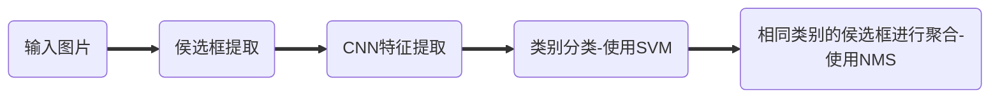

    《土豆学OD》 之 RCNN初探

# 前言

本土豆最近在做Human-Object Interaction（HOI）任务的研究，其中有用到物体识别的模块，因此也打算趁此机会把Object Detection（OD）的拿来系统学习下，并且在此纪录下笔记。土豆我深知OD已经在网络上有着很多中文博客资料了，但是个人觉得很多都不够详细，不够入门级，因此我尽量在此博客里面做到提供更多的细节等，希望尽量做到初学者友好。不过毕竟土豆在OD还是初学者，如果文章有纰漏的地方，请联系指出，谢谢。

*联系方式：*
**e-mail**: `FesianXu@gmail.com`
**QQ**: `973926198`
**github**: `https://github.com/FesianXu`

----

# 从物体识别说起

据我所知，Region-CNN也就是简称为RCNN的这篇文章[1]是最早的一批尝试将深度学习应用在物体识别这个任务上的，我觉得有必要先对之前的主流方向思路先描述下。

一般来说，物体识别这个任务需要在提供了一张图片的情况下，将图片中某些特定物体（由训练集里面的标签类别指定，如苹果，猫，狗等）的位置标记出来，这个标记需要提供该物体在图中的坐标和大小$(x,y,w,h)$，这个标记我们一般称之为**bounding box** (bbox)，如下图所示。其次需要对这个物体的类别进行分类，比如将此分类为狗，猫等，有些情况下还会给定这个分类的置信度等。其评价标准一般是mAP，mean Average Precision。

![odtask][odtask]

    <b>
        Fig 1.1 物体识别中的bbox和类别分类以及其置信度等。

一般解决这个问题的思路很直接暴力，就是用设置多个不同尺寸的窗口，然后从图像的开始出开始遍历整个图像，得到不同尺寸的窗口的遍历集合之后，对每个窗口的图像片段进行物体分类判断，最后再考虑将其相同类别的窗口进行合并等，最后得到bbox和每个bbox的类别等。这个滑动窗口的方法叫做暴力搜索(Exhaustive Search)，显然的，这种方法会导致运算量特别的大，因为由这种方法会产生大量的滑动窗口需要后续进行分类，而且，我们知道这些窗口很多都是背景或者是重复的，重叠的区块，因此其实对于后续来说是多余的。

那么为了解决这个问题，就提出了所谓的**Selective Search** [2]这种方法，这个方法尝试去从每个图像中单纯根据图像的纹理，光照，形状，颜色等底层的图像信息去提取中少量的窗口，这里将这个窗口称之为侯选框 **Proposal**。一般来说会对每个图片提取出约2000个侯选框，这个数量将远远小于暴力搜索的方法。

而后续，为了对每个侯选框进行分类，在深度学习之前，会考虑采用传统的人工设计的特征，如HOG，SIFT，DPM等，也会考虑用复合的特征，如UVA detection system[3]。那么在深度学习之后呢，就会考虑采用卷积神经网络去弄啦，这个也就是我们之后文章的主题了。

----

# Region CNN

RCNN的思路虽然很简单，看起来不值得独立写成一篇博客，但是其实其中有很多细节值得注意，其在arxiv的原始论文也达到了21页之长[4]，因此还是有必要仔细学习下细节的。主要需要注意的分为几个部分：

1. 如何提取侯选框
2. 这里使用的CNN如何设计
3. 输入的图片该怎么进行尺寸统一化
4. 类别分类器的设计
5. 正负样本挑选
6. 训练细节等

不过在陷入细节之前，我们要明确，整个RCNN的流程如：

![rcnn][rcnn]

    <b>
        Fig 2.1 RCNN的流程框图。

## 如何提取侯选框

首先使用selective search先从每张图片中提取出2000个侯选框，注意这里的侯选框是所谓类别无关的，毕竟只是根据纹理等底层图像特征得到的。我们要注意到的是，这里的每个侯选框的尺寸可能都不一样，如Fig 2.2所示。因此在输入后续的CNN时，需要进行尺寸上的统一化，一般会统一到227 x 227这个尺寸，由此又有几种不同的统一化策略。

![selective_search][selective_search]

    <b>
        Fig 2.2 Selective Search提取出来的是类别无关的侯选框，而且每个侯选框的尺寸可能不一。

统一化这个尺寸除了单纯的线性缩放之外，还有考虑到上下文和原图比例的两种策略，见：

![norm][norm]

    <b>
        Fig 2.3 不同的图像统一化策略。A列为原始的侯选框的图像，B列为考虑到了侯选框周围p个像素的结果（这里p=16），也就是考虑了侯选框周围的上下文信息了，然后再进行线性的缩放等；C列是考虑到了原图侯选框的尺寸长宽比例，因此在周围进行了填充的操作，然后在缩放成指定尺寸，在这种情况下，我们发现C列的有效图像其比例和原始侯选框是一样的；而D列是简单的直接线性缩放。

至此，我们得到了侯选框和经过统一化的侯选框图像，接下来可以喂进CNN了。

## CNN的预训练和调整

这里的CNN特征提取网络比较了两种常用的网络，一种是T-net，也就是OxfordNet  [5]，另一种是O-net，也就是TorontoNet  [6]。从结果来看，基于O-net的结果好了8个mAP，但是其速度慢了七倍，因此作者最后的实验还是基于T-net进行的。T-net的网络结构如Fig 2.4所示，这里的输入本应该是224 x 224的，不知道为什么在论文里统一化成了 227 x 227，不过这个对我们的研究影响并不大因此忽略不考虑。

![alexnet][alexnet]

    <b>
        Fig 2.4 T-net的网络结构示意图。

RCNN利用T-net从每个proposal中提取一个4096维的特征，我们会发现这里的4096维比起以前传统方法的，比如UVA detection system [3]，维度少了两个数量级，分别是4k和360k，因此大幅度提高了运算速度。

显然，这个T-net首先需要预训练，一般是在ImageNet数据集（ILSVRC2012 classification ）上利用图片级的标注（比如图片分类任务，不能利用其bbox的标签数据）先进行预训练。为了适应OD任务中$N$个物体的分类，需要将T-net的最后一层的1000类分类的层更换成$N+1$层，其中加上一表示背景。

我们注意到最后一层的池化层，也即是$Pool_{5}$层，其输出特征图尺寸为$6 \times 6 \times 256=9216$维（按照论文中报告的，和Fig 2.4所示不同）。

## 类别分类器为什么不使用softmax

那么在上一步得到了proposal的特征之后，下一步就是拿到分类器中给每个proposal进行分类了。这里的分类器采用了线性SVM分类器，也即是给每个类别都指定了一个二类线性SVM分类器，用于判定是否是本类，见Fig 2.1。那么这里为什么不用softmax分类器而是采用传统的SVM呢？作者在实验中发现如果更改为softmax，那么在VOC 2007数据集上的表现将从54.2%下降到50.9%，作者认为是因为这里的正负样本采样，并没有特别强调精细的位置关系，因此softmax是在随机采样的负样本中进行训练的，而不是如同在SVM策略中，可以采用所谓的难负样本（hard negatives）进行训练。

这里的采用的SVM可以用一个权值矩阵表达，大小为$4096 \times N$， 其中$N$表示的是类别数量，$4096$表示的是CNN输出的特征维度。那么因为一共有2000个侯选框，其实最后分类进行的是矩阵乘法 如形状为$ 2000 \times 4096$ 和形状为 $4096 \times N$的矩阵的乘法。最后得到$2000 \times N$也就是对于所有侯选框的类别打分。

## 正负样本采样策略

为了训练SVM和对CNN进行OD任务相关的Fine-Tune（毕竟CNN是在物体分类任务上预训练的，不能很好适应OD任务特性），我们需要制定策略去对正负样本进行采样。

注意到对于这两种训练，其对正负样本的定义是不同的。

### 对于SVM训练而言

由于SVM是二分类器，因此需要对每个类独立训练一个SVM。

考虑到对一个二类分类器对车进行分类，如果proposal完全包含了车，那么当然，这个判断为正类；如果proposal是和车完全无关的事物，那么当然，其判断为负类。但是，如果是proposal一部分包含了车，一部分没有包含呢？这个时候需要依靠其proposal和真实的bbox的IoU的大小进行判断，小于这个阈值的视为负类，而真实的bbox则视为正类，这里根据实验设置为0.3（当然，可能会依据使用场合而调整）。

因此，依据这个简单的策略，对于每个类都划分了正类。因为SVM属于稀疏核方法，需要记忆住一部分的支持向量数据，因此如果将所有训练数据一次性喂进去模型，那么内存是撑不住的，因此作者使用了所谓的难负类挖掘方法（hard negative mining method）[8] 去找出最难分类正确的负类进行代表整个负类集合（因为一般来说，对于每个类都是负类的proposal要远大于正类的proposal数量。）

| 样本   | 来源                                            |
| ------ | ----------------------------------------------- |
| 正样本 | Ground Truth                                    |
| 负样本 | Ground Truth与proposal相交IoU 小于0.3的proposal |

### 对于CNN的fine tune而言

对于CNN的fine tune来说，正负样本的采样会复杂一点。

| 样本   | 来源                                           |
| ------ | ---------------------------------------------- |
| 正样本 | Ground Truth与proposal相交IoU大于0.5的proposal |
| 负样本 | 与Ground Truth相交IoU小于等于0.5的proposal     |

我们发现因为正样本数量远小于负样本数量，因此不单单采用了ground truth的bbox，而且与其IoU大于0.5的proposal都被当为了正样本，以此增加了正样本的数量。（文章说提高了30倍的正样本数）

### 对于bbox 回归任务而言

| 样本   | 来源                                   |
| ------ | -------------------------------------- |
| 正样本 | 与ground truth相交IoU大于0.6的proposal |

## 非极大抑制 NMS

在进行完了以上的一系列步骤后，我们现在已经按理来说对2000个proposal进行了分类了，分类出$N+1$个类。那么现在我们的情况可能如Fig 2.5所示，对于某个特定的类，比如猫，周围有一堆proposal，我们需要综合这若干个proposal的信息以得出一个最后的bbox预测结果，我们通常这个时候采用非极大抑制(Non Maximum suppression)。

![nms][nms]

    <b>
        Fig 2.5 非极大抑制以汇聚侯选框，以得到最后的bbox结果。

其操作很简单，对于某个类的proposal，我们知道每个proposal都会有对这个类别的打分，视为置信度，如果两个proposal之间的IoU大于一个阈值，则选取打分最高的留下来作为proposal，而另一个删除。若IoU小于这个阈值，那么就融合这两个proposal的并集作为结果。

-----

# bbox回归

用了以上的策略，我们的RCNN的表现已经能够超越以前的工作了，但是还不够。我们知道根据selective search选出来的侯选框直接决定了后续的物体的bbox的标定和类别的决定，但是selective search是一个静态过程，是不能学习的，也是不能调整的，这就直接决定了其bbox的效果固定了。这个很糟糕，应该是可以提高的。因此作者借鉴DPM模型[7]中的策略，对bbox进行回归，期待可以微调bbox的位置，取得更好效果。如Fig 3.1所示，我们将$N$个训练样本表示为$\{(P^i, G^i)\}_{i=1,\cdots,N}$，其中$P^{i}=(P^i_x, P^i_y, P^i_w, P^i_h)$表示第$i$个样本的proposal中心的坐标$(P_x, P_y)$和proposal的长宽。对应的，$G^{i}=(G^i_x, G^i_y, G^i_w, G^i_h)$ 表示的是真实的标签的bbox的坐标和长宽，因此在这个回归任务中，希望学习到函数$f(\cdot)$，使得$f(P) \rightarrow G$。

![bbox_reg][bbox_reg]

    <b>
        Fig 3.1 bbox的回归和更新。

我们将这个$f(\cdot)$拆解成四个函数，分别是$d_x(P), d_y(P), d_w(P), d_h(P)$。最后我们有对bbox回归后的估计结果为:
$$
\begin{align}
\hat{G}_x &= P_wd_x(P)+P_x \\
\hat{G}_y &= P_hd_y(P)+P_y \\
\hat{G}_w &= P_w \exp(d_w(P)) \\
\hat{G}_h &= P_h \exp(d_h(P))
\end{align}
\tag{3.1}
$$
我们可以看到对于坐标 $x,y$ 而言，其是用求增量的形式进行的，而对于长宽$w,h$则是直接的缩放。

为了简单起见，这里的$d_{\star}(P)$采用的是线性回归，用池化层$Pool_{5}$的输出作为$P$的特征，也即是表示为$\phi_5(P)$，因此对于$\star = x,y,w,h$分别来说，都有 $d_{\star}(P) = \hat{\mathbf{w}_{\star}}^T \phi_5 (P)$。

最后用loss去描述，为:
$$
\mathbf{w}_{\star} = \arg\min_{\hat{\mathbf{w}_{\star}}} \sum_{i}^{N}(t^{i}_{\star}-\hat{\mathbf{w}_{\star}}^T \phi_5(P^i))^2+\lambda||\hat{\mathbf{w}_{\star}}||^2
\tag{3.2}
$$

在这个形式中，因为我们的目标$t_{\star}$可以表达成：
$$
\begin{align}
t_x &= (G_x-P_x)/P_w \\
t_y &= (G_y-P_y)/P_h \\
t_w &= \log(G_w/P_w) \\
t_h &= \log(G_h/P_h)
\end{align}
\tag{3.3}
$$
因此可以将其描述为标准的最小二乘法问题，求得其闭式解。

在实验中发现，这里的正则系数$\lambda$选择很重要，这里选择为1000。还有个问题我们要注意到的就是如果当这个$P$和$G$偏差的很大的时候，那么这个回归任务其实是没有太大意义的，只有当两者比较接近时，才能提供足够的优化效果。那么为了筛选出这个所谓的“足够接近”，作者在训练时，将proposal和真实的bbox的IoU(Intersection over Union)超过一定的阈值时（这里选择0.6），才认为是有效的可以进行回归的proposal，其他全部去掉。

在测试阶段，我们可以对所有的proposal进行打分，然后一次性预测其回归后的新的检测窗口的位置。但其实也是可以进行迭代的，比如反复地进行打分，然后回归新的窗口，然后对新的窗口再打分再预测，直到收敛为止。然而，作者发现这个迭代并不能提高性能。

实验发现加入bbox回归这个模块可以大幅提高性能，如Fig 3.2所示。

![bbresult][bbresult]

    <b>
        Fig 3.2 在VOC 2007上的实验结果，FT表示进行了Fine Tune的CNN，BB表示进行了bbox的回归，我们可以发现加入了bbox回归之后，其mAP提高了将近4%。

-----

# Reference

[1]. Girshick, R., Donahue, J., Darrell, T., & Malik, J. (2014). Rich feature hierarchies for accurate object detection and semantic segmentation. In *Proceedings of the IEEE conference on computer vision and pattern recognition* (pp. 580-587).

[2]. Uijlings J R R , K. E. A. van de Sande…. Selective Search for Object Recognition[J]. International Journal of Computer Vision, 2013, 104(2):154-171.

[3]. J. Uijlings, K. van de Sande, T. Gevers, and A. Smeulders. Selective search for object recognition. IJCV, 2013.  

[4]. https://arxiv.org/abs/1311.2524

[5]. A. Krizhevsky, I. Sutskever, and G. Hinton. ImageNet classification with deep convolutional neural networks. In NIPS, 2012 

[6]. K. Simonyan and A. Zisserman. Very Deep Convolutional Networks for Large-Scale Image Recognition. arXiv preprint, arXiv:1409.1556, 2014. 

[7]. P. Felzenszwalb, R. Girshick, D. McAllester, and D. Ramanan. Object detection with discriminatively trained part
based models. TPAMI, 2010.  

[8]. P. Felzenszwalb, R. Girshick, D. McAllester, and D. Ramanan. Object detection with discriminatively trained part
based models. TPAMI, 2010 

[9]. https://blog.csdn.net/weixin_39306118/article/details/89763646

[odtask]: ./imgs/odtask.jpg

[rcnn]: ./imgs/rcnn.jpg
[selective_search]: ./imgs/selective_search.jpg
[norm]: ./imgs/norm.jpg
[alexnet]: ./imgs/alexnet.jpg

[bbox_reg]: ./imgs/bbox_reg.png

[bbresult]: ./imgs/bbresult.jpg

[nms]: ./imgs/nms.png

