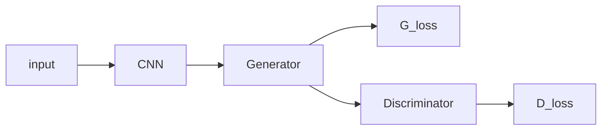
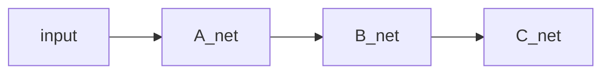

<div align='center'>
在pytorch中停止梯度流的若干办法，避免不必要模块的参数更新
<div/>
<div align='right'>
2020/4/11 FesianXu
<div/>

# 前言
在现在的深度模型软件框架中，如TensorFlow和PyTorch等等，都是实现了自动求导机制的。在深度学习中，有时候我们需要对某些模块的梯度流进行精确地控制，包括是否允许某个模块的参数更新，更新地幅度多少，是否每个模块更新地幅度都是一样的。这些问题非常常见，但是在实践中却很容易出错，我们在这篇文章中尝试对第一个子问题，也就是如果精确控制某些模型是否允许其参数更新，进行总结。**如有谬误，请联系指出，转载请注明出处。**

本文实验平台：`pytorch 1.4.0`, `ubuntu 18.04`, `python 3.6`

$\nabla$ 联系方式：
e-mail: FesianXu@gmail.com
QQ: 973926198
github: https://github.com/FesianXu

----

# 为什么我们要控制梯度流
为什么我们要控制梯度流？这个答案有很多个，但是都可以归结为**避免不需要更新的模型模块被参数更新**。 我们在深度模型训练过程中，很可能存在多个loss，比如GAN对抗生成网络，存在`G_loss`和`D_loss`，通常来说，我们通过`D_loss`只希望更新判别器(Discriminator)，而生成网络(Generator)并不需要，也不能被更新；生成网络只在通过`G_loss`学习的情况下，才能被更新。这个时候，如果我们不控制梯度流，那么我们在训练`D_loss`的时候，我们的前端网络`Generator`和`CNN`难免也会被一起训练，这个是我们不期望发生的。


<div align='center'>
<b>
Fig 1.1 典型的GAN结构，由生成器和判别器组成。
<b/>
<div/>

多个loss的协调只是其中一种情况，还有一种情况是：我们在进行模型迁移的过程中，经常采用某些已经预训练好了的特征提取网络，比如`VGG, ResNet`之类的，在适用到具体的业务数据集时候，特别是小数据集的时候，我们可能会希望这些前端的特征提取器不要更新，而只是更新末端的分类器（因为数据集很小的情况下，如果贸然更新特征提取器，很可能出现不期望的严重过拟合，这个时候的合适做法应该是更新分类器优先），这个时候我们也可以考虑停止特征提取器的梯度流。

这些情况还有很多，我们在实践中发现，精确控制某些模块的梯度流是非常重要的。笔者在本文中打算讨论的是对**某些模块的梯度流的截断**，而并没有讨论对某些模块梯度流的比例缩放，或者说最细粒度的梯度流控制，后者我们将会在后文中讨论。

一般来说，截断梯度流可以有几种思路：
1. 停止计算某个模块的梯度，在优化过程中这个模块还是会被考虑更新，然而因为梯度已经被截断了，因此不能被更新。

   - 设置`tensor.detach()`： 完全截断之前的梯度流
   - 设置参数的`requires_grad`属性：单纯不计算当前设置参数的梯度，不影响梯度流
   - `torch.no_grad()`：效果类似于设置参数的`requires_grad`属性
2. 在优化器中设置不更新某个模块的参数，这个模块的参数在优化过程中就不会得到更新，然而这个模块的梯度在反向传播时仍然可能被计算。

我们后面分别按照这两大类思路进行讨论。

------


# 停止计算某个模块的梯度
在本大类方法中，主要涉及到了`tensor.detach()`和`requires_grad`的设置，这两种都无非是对某些模块，某些节点变量设置了是否需要梯度的选项。
## tensor.detach()

`tensor.detach()`的作用是：

> `tensor.detach()`会创建一个与原来张量共享内存空间的一个新的张量，不同的是，这个新的张量将不会有梯度流流过，这个新的张量就像是从原先的计算图中脱离(detach)出来一样，对这个新的张量进行的任何操作都不会影响到原先的计算图了。因此对此新的张量进行的梯度流也不会流过原先的计算图，从而起到了截断的目的。

这样说可能不够清楚，我们举个例子。众所周知，我们的pytorch是动态计算图网络，正是因为计算图的存在，才能实现自动求导机制。考虑一个表达式：
$$
y = x^2 \\
z = 2 * y\\
w = z^3
$$
如果用计算图表示则如Fig 2.1所示。

![com_graph][com_graph]

<div align='center'>
<b>
Fig 2.1 计算图示例
<b/>
<div/>

考虑在这个式子的基础上，加上一个分支：
$$
p = z \\
q = 2.0 \\
pq = p * q 
$$
那么计算图就变成了：

​	![branch][branch]

<div align='center'>
<b>
Fig 2.2 添加了新的分支后的计算图
<b/>
<div/>

如果我们不`detach()` 中间的变量`z`，分别对`pq`和`w`进行反向传播梯度，我们会有：

```python
x = torch.tensor(([1.0]),requires_grad=True)
y = x**2
z = 2*y
w= z**3

# This is the subpath
# Do not use detach()
p = z
q = torch.tensor(([2.0]), requires_grad=True)
pq = p*q
pq.backward(retain_graph=True)

w.backward()
print(x.grad)
```

输出结果为`tensor([56.])`。我们发现，这个结果是吧`pq`和`w`的反向传播结果都进行了考虑的，也就是新增加的分支的反向传播影响了原先主要枝干的梯度流。这个时候我们用`detach()`可以把`p`给从原先计算图中脱离出来，使得其不会干扰原先的计算图的梯度流，如：

![detach][detach]

<div align='center'>
<b>
Fig 2.3 用了detach之后的计算图
<b/>
<div/>

那么，代码就对应地修改为：

```python
x = torch.tensor(([1.0]),requires_grad=True)
y = x**2
z = 2*y
w= z**3

# detach it, so the gradient w.r.t `p` does not effect `z`!
p = z.detach()
q = torch.tensor(([2.0]), requires_grad=True)
pq = p*q
pq.backward(retain_graph=True)
w.backward()
print(x.grad)
```

这个时候，因为分支的梯度流已经影响不到原先的计算图梯度流了，因此输出为`tensor([48.])`。

这只是个计算图的简单例子，在实际模块中，我们同样可以这样用，举个GAN的例子，代码如：

```python
    def backward_D(self):
        # Fake
        # stop backprop to the generator by detaching fake_B
        fake_AB = self.fake_B
        # fake_AB = self.fake_AB_pool.query(torch.cat((self.real_A, self.fake_B), 1))
        self.pred_fake = self.netD.forward(fake_AB.detach())
        self.loss_D_fake = self.criterionGAN(self.pred_fake, False)

        # Real
        real_AB = self.real_B # GroundTruth
        # real_AB = torch.cat((self.real_A, self.real_B), 1)
        self.pred_real = self.netD.forward(real_AB)
        self.loss_D_real = self.criterionGAN(self.pred_real, True)

        # Combined loss
        self.loss_D = (self.loss_D_fake + self.loss_D_real) * 0.5

        self.loss_D.backward()

    def backward_G(self):
        # First, G(A) should fake the discriminator
        fake_AB = self.fake_B
        pred_fake = self.netD.forward(fake_AB)
        self.loss_G_GAN = self.criterionGAN(pred_fake, True)

        # Second, G(A) = B
        self.loss_G_L1 = self.criterionL1(self.fake_B, self.real_B) * self.opt.lambda_A

        self.loss_G = self.loss_G_GAN + self.loss_G_L1

        self.loss_G.backward()


    def forward(self):
        self.real_A = Variable(self.input_A)
        self.fake_B = self.netG.forward(self.real_A)
        self.real_B = Variable(self.input_B)

    # 先调用 forward, 再 D backward， 更新D之后； 再G backward， 再更新G
    def optimize_parameters(self):
        self.forward()

        self.optimizer_D.zero_grad()
        self.backward_D()
        self.optimizer_D.step()

        self.optimizer_G.zero_grad()
        self.backward_G()
        self.optimizer_G.step()
```

我们注意看第六行，`self.pred_fake = self.netD.forward(fake_AB.detach())`使得在反向传播`D_loss`的时候不会更新到`self.netG`，因为`fake_AB`是由`self.netG`生成的，代码如`self.fake_B = self.netG.forward(self.real_A)`。


## 设置requires_grad

`tensor.detach()`是截断梯度流的一个好办法，但是在设置了`detach()`的张量之前的所有模块，梯度流都不能回流了（不包括这个张量本身，这个张量已经脱离原先的计算图了），如以下代码所示：

```python
x = torch.randn(2, 2)
x.requires_grad = True

lin0 = nn.Linear(2, 2)
lin1 = nn.Linear(2, 2)
lin2 = nn.Linear(2, 2)
lin3 = nn.Linear(2, 2)
x1 = lin0(x)
x2 = lin1(x1)
x2 = x2.detach() # 此处设置了detach，之前的所有梯度流都不会回传了
x3 = lin2(x2)
x4 = lin3(x3)
x4.sum().backward()
print(lin0.weight.grad)
print(lin1.weight.grad)
print(lin2.weight.grad)
print(lin3.weight.grad)
```

输出为:

```
None
None
tensor([[-0.7784, -0.7018],
        [-0.4261, -0.3842]])
tensor([[ 0.5509, -0.0386],
        [ 0.5509, -0.0386]])
```

我们发现`lin0.weight.grad`和`lin0.weight.grad`都为`None`了，因为通过脱离中间张量，原先计算图已经和当前回传的梯度流脱离关系了。

这样有时候不够理想，因为我们可能存在只需要某些中间模块不计算梯度，但是梯度仍然需要回传的情况，在这种情况下，如下图所示，我们可能只需要不计算`B_net`的梯度，但是我们又希望计算`A_net`和`C_net`的梯度，这个时候怎么办呢？当然，通过`detach()`这个方法是不能用了。



事实上，我们可以通过设置张量的``requires_grad``属性来设置某个张量是否计算梯度，而这个不会影响梯度回传，只会影响当前的张量。修改上面的代码，我们有：

```python
x = torch.randn(2, 2)
x.requires_grad = True

lin0 = nn.Linear(2, 2)
lin1 = nn.Linear(2, 2)
lin2 = nn.Linear(2, 2)
lin3 = nn.Linear(2, 2)
x1 = lin0(x)
x2 = lin1(x1)
for p in lin2.parameters():
    p.requires_grad = False
x3 = lin2(x2)
x4 = lin3(x3)
x4.sum().backward()
print(lin0.weight.grad)
print(lin1.weight.grad)
print(lin2.weight.grad)
print(lin3.weight.grad)
```

输出为:

```
tensor([[-0.0117,  0.9976],
        [-0.0080,  0.6855]])
tensor([[-0.0075, -0.0521],
        [-0.0391, -0.2708]])
None
tensor([[0.0523, 0.5429],
        [0.0523, 0.5429]])
```

啊哈，正是我们想要的结果，只有设置了`requires_grad=False`的模块没有计算梯度，但是梯度流又能够回传。

另外，设置`requires_grad`经常用在对输入变量和输入的标签进行新建的时候使用，如：

```python
for mat,label in dataloader:
    mat = Variable(mat, requires_grad=False)
    label = Variable(mat,requires_grad=False)
    ...
```

当然，通过把所有前端网络都设置`requires_grad=False`，我们可以实现类似于`detach()`的效果，也就是把该节点之前的所有梯度流回传截断。以VGG16为例子，如果我们只需要训练其分类器，而固定住其特征提取器网络的参数，我们可以采用将前端网络的所有参数的`requires_grad`设置为`False`，因为这个时候完全不需要梯度流的回传，只需要前向计算即可。代码如：

```python
model = torchvision.models.vgg16(pretrained=True)
for param in model.features.parameters():
    param.requires_grad = False
```


## torch.no_grad()

在对训练好的模型进行评估测试时，我们同样不需要训练，自然也不需要梯度流信息了。我们可以把所有参数的`requires_grad`属性设置为`False`，事实上，我们常用`torch.no_grad()`上下文管理器达到这个目的。即便输入的张量属性是`requires_grad=True`,   `torch.no_grad()`可以将所有的中间计算结果的该属性**临时**转变为`False`。

如例子所示：

```python
x = torch.randn(3, requires_grad=True)
x1 = (x**2)
print(x.requires_grad)
print(x1.requires_grad)

with torch.no_grad():
    x2 = (x**2)
    print(x1.requires_grad)
    print(x2.requires_grad)
```

输出为：

```python
True
True
True
False
```

注意到只是在`torch.no_grad()`上下文管理器范围内计算的中间变量的属性`requires_grad`才会被转变为`False`，在该管理器外面计算的并不会变化。

不过和单纯手动设置`requires_grad=False`不同的是，在设置了`torch.no_grad()`之前的层是不能回传梯度的，延续之前的例子如：

```python
x = torch.randn(2, 2)
x.requires_grad = True

lin0 = nn.Linear(2, 2)
lin1 = nn.Linear(2, 2)
lin2 = nn.Linear(2, 2)
lin3 = nn.Linear(2, 2)
x1 = lin0(x)
with torch.no_grad():
    x2 = lin1(x1)
x3 = lin2(x2)
x4 = lin3(x3)
x4.sum().backward()
print(lin0.weight.grad)
print(lin1.weight.grad)
print(lin2.weight.grad)
print(lin3.weight.grad)
```

输出为：

```
None
None
tensor([[-0.0926, -0.0945],
        [-0.2793, -0.2851]])
tensor([[-0.5216,  0.8088],
        [-0.5216,  0.8088]])
```

此处如果我们打印`lin1.weight.requires_grad`我们会发现其为`True`，但是其中间变量`x2.requires_grad=False`。

一般来说在实践中，我们的`torch.no_grad()`通常会在测试模型的时候使用，而不会选择在选择性训练某些模块时使用[1]，例子如：

```python
model.train()
# here train the model, just skip the codes
model.eval() # here we start to evaluate the model
with torch.no_grad():
	for each in eval_data:
		data, label = each
		logit = model(data)
		... # here we just skip the codes
```


## 注意

通过设置属性`requires_grad=False`的方法（包括`torch.no_grad()`）很多时候可以避免保存中间计算的buffer，从而减少对内存的需求，但是这个也是视情况而定的，比如如[2]的所示


如果我们不需要`A_net`的梯度，我们设置所有`A_net`的`requires_grad=False`，因为后续的`B_net`和`C_net`的梯度流并不依赖于`A_net`，因此不计算`A_net`的梯度流意味着不需要保存这个中间计算结果，因此减少了内存。

但是如果我们不需要的是`B_net`的梯度，而需要`A_net`和`C_net`的梯度，那么问题就不一样了，因为`A_net`梯度依赖于`B_net`的梯度，就算不计算`B_net`的梯度，也需要保存回传过程中`B_net`中间计算的结果，因此内存并不会被减少。

但是通过`tensor.detach()`的方法并不会减少内存使用，这一点需要注意。


----

# 设置优化器的更新列表

这个方法更为直接，即便某个模块进行了梯度计算，我只需要在优化器中指定不更新该模块的参数，那么这个模块就和没有计算梯度有着同样的效果了。如以下代码所示:

```python
class model(nn.Module):
    def __init__(self):
        super().__init__()
        self.model_1 = nn.linear(10,10)
        self.model_2 = nn.linear(10,20)
        self.fc = nn.linear(20,2)
        self.relu = nn.ReLU()
       
   	def foward(inputv):
        h = self.model_1(inputv)
        h = self.relu(h)
        h = self.model_2(inputv)
        h = self.relu(h)
        return self.fc(h)
```

在设置优化器时，我们只需要更新`fc层`和`model_2层`，那么则是:

```python
curr_model = model()
opt_list = list(curr_model.fc.parameters())+list(curr_model.model_2.parameters())
optimizer = torch.optim.SGD(opt_list, lr=1e-4)
```

当然你也可以通过以下的方法去设置每一个层的学习率来避免不需要更新的层的更新[3]：

```python
optim.SGD([
                {'params': model.model_1.parameters()},
                {'params': model.mode_2.parameters(), 'lr': 0},
    		   {'params': model.fc.parameters(), 'lr': 0}
            ], lr=1e-2, momentum=0.9)
```


这种方法不需要更改模型本身结构，也不需要添加模型的额外节点，但是需要保存梯度的中间变量，并且将会计算不需要计算的模块的梯度（即便最后优化的时候不考虑更新），这样浪费了内存和计算时间。

# Reference

[1]. https://blog.csdn.net/LoseInVain/article/details/82916163

[2]. https://discuss.pytorch.org/t/requires-grad-false-does-not-save-memory/21936

[3]. https://pytorch.org/docs/stable/optim.html#module-torch.optim


[com_graph]:  ./imgs/com_graph.png.

[branch]: ./imgs/branch.png
[detach]: ./imgs/detach.png


